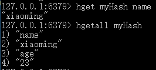

# 006-redis之hash类型

## 1、存储
语法: `hset <key> <field> <value>` 或 `hmset <key> <field> <value> <field> <value>...`

往key添加一个hash，该hash`属性=field; 值=value`的hash

```shell
hset myHash name xiaoming
hset myHash age 23
```
上面代码类似往redis写一个myHash变量，值为`{name:'xiaoming', age:23}`

hset一次只能设置一个值，如果想要设置多个，可以使用hmset
```shell
hmset myHash name xiaoming age 23 sex 男 
```


## 2、获取
* 语法1: `hget <key> <field>`， 获取key的field的值
* 语法2: `hgetall <key>`，获取key的hash内容
```shell
# 相当于获取`myHash.name`的值
hget myHash name

# 相当于获取`myHash`的内容
hgetall myHash
```



## 3、删除
语法: `hdel <key> <field>`
```shell
hdel myHash name
```
