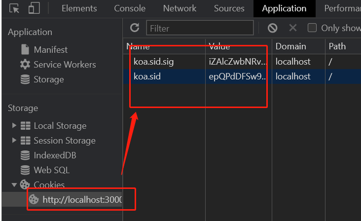
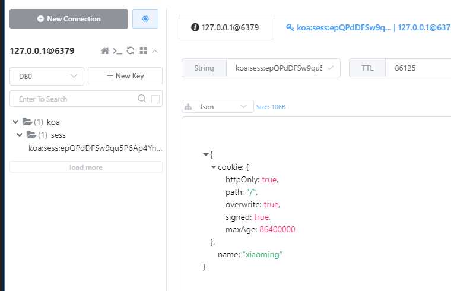
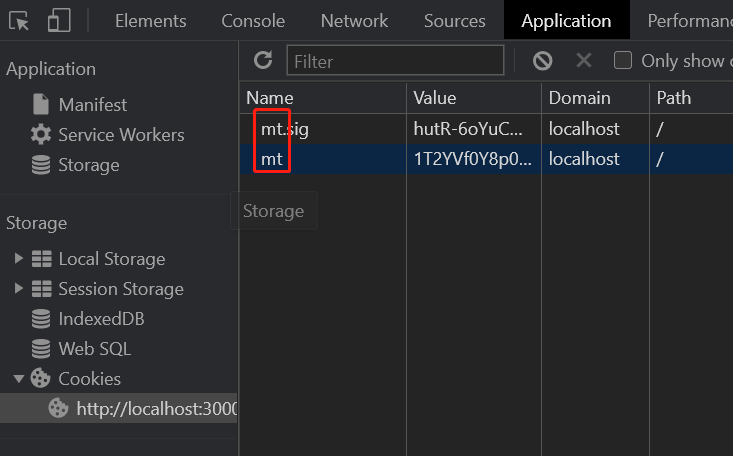
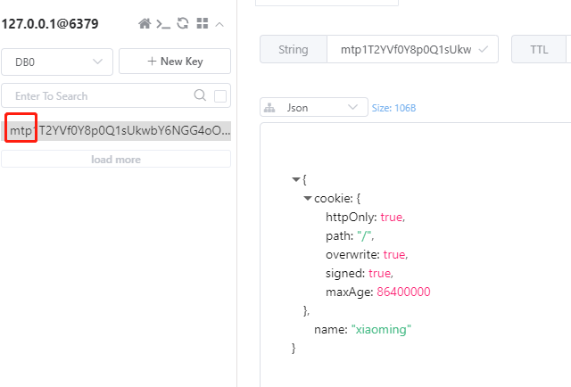

# 013-koa连接redis

koa连接redis，可以用node的那个方法完全可以

如果还想要把session操作存到redis里面，最好用`koa-redis + koa-generic-session`一起使用


## 1、 koa连接redis
安装: `npm i -S koa-redis`

```js
const redisStore = require('koa-redis');
const Store = new redisStore().client;

(async function () {
    await Store.set('cname', '中国23');
    console.log('获取redis的值', await Store.get('cname'));
})();
```

`koa-redis`更多的是和`koa-generic-session`搭配使用，简化`session + redis`操作


## 2、koa操作session+redis
安装: `npm i -S koa-generic-session koa-redis`

* `koa-generic-session`: 用来简化session操作
* `koa-redis`: 用来连接redis

1. 在`/app.js`中引入redis和session
```js
const session = require('koa-generic-session');
const redisStore = require('koa-redis');

app.keys = ['keys', 'keykeys']; // session加密用的
app.use(session({
    store: redisStore() // 指定session存到redis，不写则按照旧的存在服务器内容中
}));
```
这样，后面操作session，都会存储到redis中

2. 修改`http://localhost:3000/users`对应的请求处理
```js
router.prefix('/users');
router.get('/', async (ctx, next) => {
    ctx.session.name = 'xiaoming'; // 像往常一样处理session即可
    ctx.body = 'this is a users response!';
});
```

然后访问下`http://localhost:3000/users`，查看页面上的cookie，发现有下面信息，信息是加密后的




如果想要看详细信息，可以登录redis服务
```shell
keys * // 得到key=koa:sess:epQPdDFSw9qu5P6Ap4YnYWNaZ5kcj_V9

get koa:sess:epQPdDFSw9qu5P6Ap4YnYWNaZ5kcj_V9 // 得到具体的值"{\"cookie\":{\"httpOnly\":true,\"path\":\"/\",\"overwrite\":true,\"signed\":true,\"maxAge\":86400000},\"name\":\"xiaoming\"}"
```

或者用redis客户端直接看




### 2.1 配置项
```js
app.use(session({
    key: 'mt', // 浏览器cookie的前缀
    prefix: 'mtp', // redis中名字的前缀
    store: redisStore()
}));
```
* `key`配置的是浏览器cookie的名字前缀



* `prefix`控制的是redis中名字的前缀


