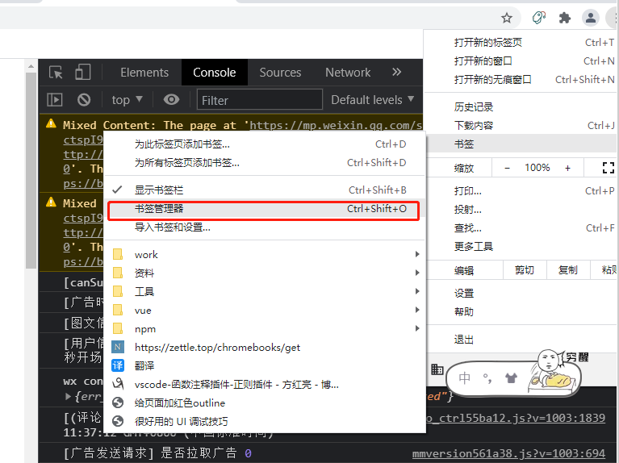
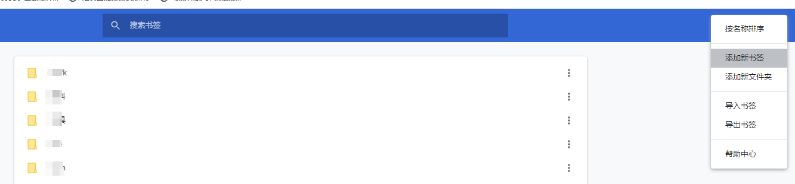
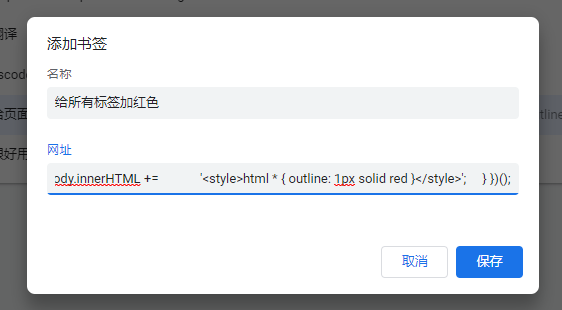

# 20210628

### 1、cnpm 不支持 package-lock
使用 `cnpm install` 时候，并不会生成 `package-lock.json` 文件。`cnpm install` 的时候，就算你项目中有 `package-lock.json` 文件，cnpm 也不会识别，仍会根据 `package.json` 来安装。所以这就是为什么之前你用 npm 安装产生了 `package-lock.json`，后面的人用 cnpm 来安装，可能会跟你安装的依赖包不一致。

因此，尽量不要直接使用 cnpm install 安装项目依赖包。但是为了解决直接使用 npm install 速度慢的问题，可以设置 npm 代理解决。


### 2、将js作为chrome书签
比如下面js代码，实现给页面的所有标签加红色边框
```js
javascript: (function() {
    var elements = document.body.getElementsByTagName('*');
    var items = [];
    for (var i = 0; i < elements.length; i++) {
        if (elements[i].innerHTML.indexOf('html * { outline: 1px solid red }') != -1) {
            items.push(elements[i]);
        }
    }
    if (items.length > 0) {
        for (var i = 0; i < items.length; i++) {
            items[i].innerHTML = '';
        }
    } else {
        document.body.innerHTML +=
            '<style>html * { outline: 1px solid red }</style>';
    }
})();
```


我们需要借助 Chrome 的书签功能。

1. 打开书签管理页
2. 右上角三个点「添加新书签」
3. 名称随意，粘贴以下代码到网址中





有时候不成功就把代码中的空格借助下在线压缩代码工具都去掉