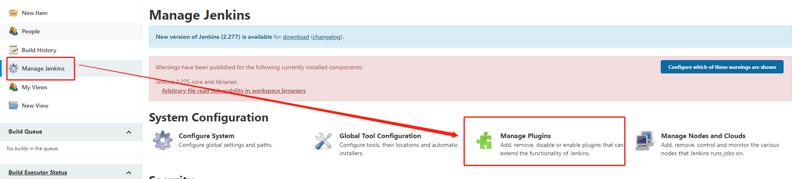
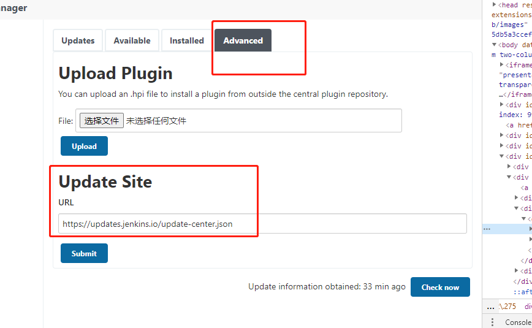
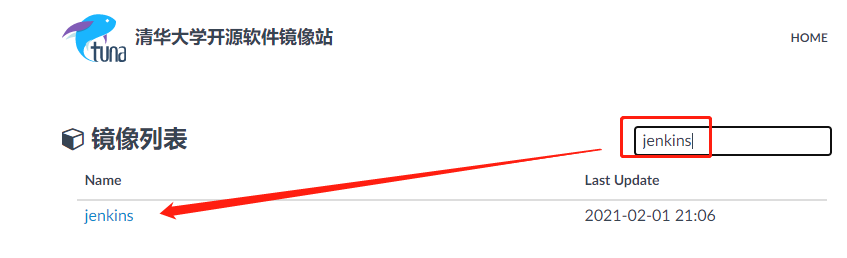
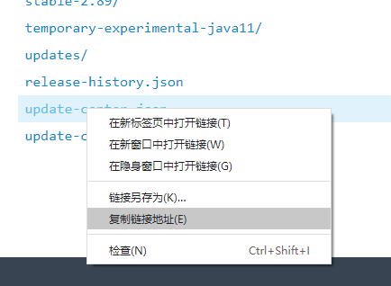
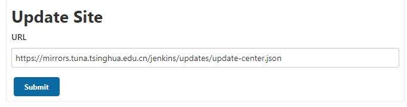

# 002-配置国内镜像

1. 左侧 `Manage Jenkins - Manage Plugins - Advanced - Update Site`

2. 前往[清华加速源](https://mirrors.tuna.tsinghua.edu.cn/)，搜索jenkins，然后找到[updata-center.json](https://mirrors.tuna.tsinghua.edu.cn/jenkins/updates/update-center.json)，复制链接出来

3. 将清华源的地址复制到`Update Site`里面，提交接口，后面jenkins就会从清华源下载插件

