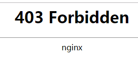
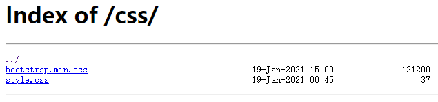

# 010-autoIndex开启展示文件夹内容

当用户访问某个文件夹的时候，nginx默认不会将文件夹内容列出来

比如`https://zettle.top/css/`里面是几个css资源，默认访问的时候是403



开启autoIndex功能，修改`nginx.conf`如下:
```nginx
location / {
    root   /root/svr/zettle;
    index  index.html index.htm;
    autoindex on; # 开启autoIndx
}
```
在访问`https://zettle.top/css/`就可以看到里面的文件列表了



