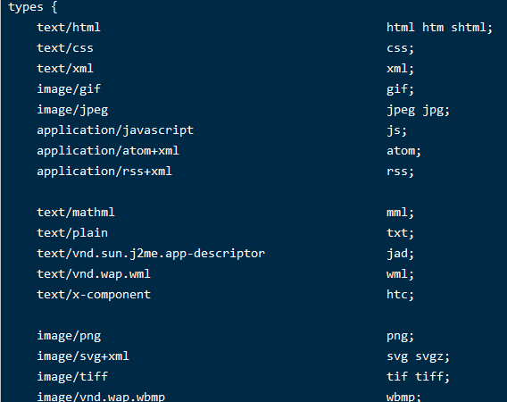

# 018-nginx开启gzip

gzip原理：浏览器发出请求的时候，会在请求头带上`Accept-Encoding: gzip, deflate, br`告诉服务端自己支持的哪些压缩算法，然后服务端根据支持的在服务端压缩好后返回既可，目前gzip是最普遍使用的压缩算法

## 1、开启gzip的常用配置
启动gzip

```nginx
# 开启Gzip，on-开启 off-关闭
gzip on;

# 不压缩临界值，大于1K的才压缩，一般不用改
gzip_min_length 1k;

# 缓冲：压缩在内存中缓冲几块就往外输出，每块多大
# 建议不配置，默认既可
# gzip_buffers 32 4k;

# 开始压缩的http协议版本，默认1.1，如果真的遇到1.0就改为1.0
# 目前基本都是1.1，所以不用配置
#gzip_http_version 1.1;

# 压缩级别，1-10，数字越大压缩的越好，时间也越长，CPU越消耗，一般就写6既可
gzip_comp_level 6;

# 进行压缩的文件类型，缺啥补啥就行了，JavaScript有两种写法，最好都写上吧，总有人抱怨js文件没有压缩，其实多写一种格式就行了
# 一般图片/mp3这种二进制文件也不压缩，压缩比例不是很高还浪费资源
gzip_types text/plain application/x-javascript text/css text/xml application/xml text/javascript application/javascript;

# 是否携带gzip压缩标识，建议开启
# 跟Squid等缓存服务有关，on的话会在Header里增加"Vary: Accept-Encoding"
gzip_vary on;

# 禁止gzip的，匹配到了就不给gzip压缩，
# IE6对Gzip不怎么友好，不给它Gzip了
gzip_disable "MSIE [1-6]\.";

# 有前置机子的时候配置的
# 设置请求者代理服务器，该如何缓存内容
# gzip_proxied ;
```


## gzip_types的配置
当我们不知道某个文件要具体写什么的时候，可以到 `cong/mime.types` 里面找，里面有所有的mine类型


